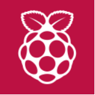
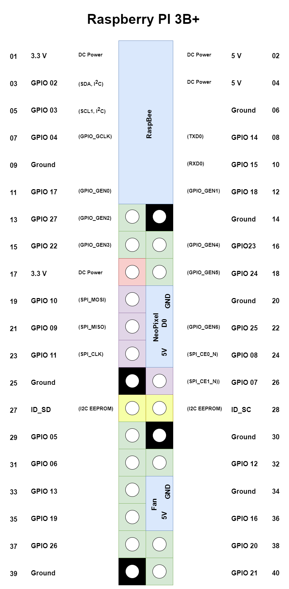

# berry-setup

This project contains the documentation of my raspberry pi projects. 
This includes self written software and external software used via docker-compose file. 
If you just starting with raspberry pi you can read the beginners [@here](https://gitlab.com/movative/raspi-setup/-/wikis/home). 
 

## How to begin with berry-setup

1. Install Raspberry OS
1. `sh <(curl -s https://api.github.com/repos/movative/berry-setup/contents)`
1. Choose your services and configure them over the environment files.
1. `docker-compose up`

## Hardware Setup

