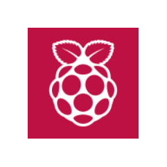
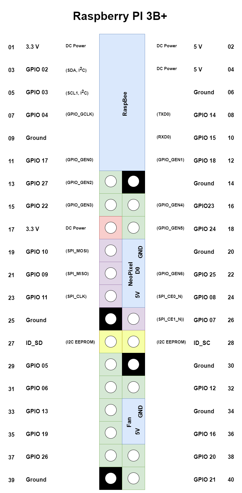

# berry-setup

This project contains the documentation of my raspberry pi setup. 
This includes self written software and other open source software. 
To easily start the project I use docker-containers, docker-compose and environment files to configure them. [[Logo created with diagram.net]](https://app.diagrams.net/)
 

<!---
## How to begin with berry-setup

1. Install Raspberry OS. [[More info @getting-started/guide.md]](getting-started/guide.md)
1. Execute `sh <(curl -s https://api.github.com/repos/movative/berry-setup/contents)`.
1. Choose your services and configure them over the environment files.
1. Execute `docker-compose up`
-->

## Hardware Setup
What you need to use the most parts of this project:
- Raspberry PI 3B+
- SD Card

What you need for all parts of this project:
- Raspberry PI Fan
- NeoPixel 
- RaspBee HAT

On the next Image you can see which pins´s I used on the Raspberry PI 3B+.

