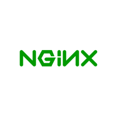

# Rocket.Chat

nginx is a open source webserver, which is lightweight and powerfull.
We use it in our project as a reverse proxy to use all web apps on port 80. 
[[Logo created with diagram.net]](https://app.diagrams.net/)  

## Install
